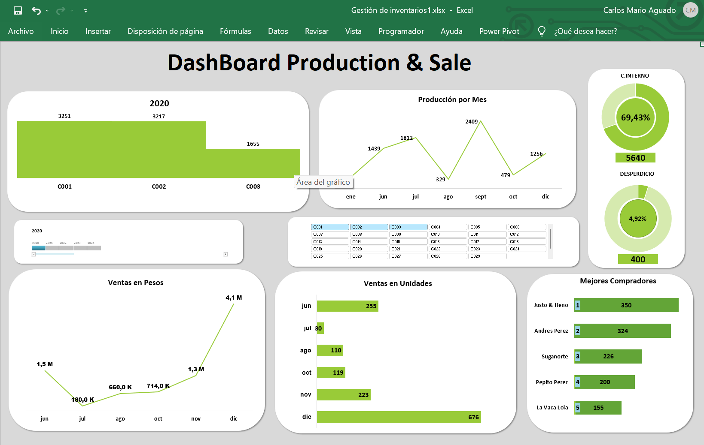

# 📊 LiveStock Feed Dashboard (Small Business case in Colombia)

This project is based on a real case from a small agricultural company **(PYME)** in Colombia. The company decided to expand its businees into the **livestock feed** market, beginning with the production and sale of **hay** in the region.

# 🧩 The Challenge

Due to manually control inventory tracking and lack of real-time data the business faced:

- **High waste and internal consumption**
- **Poor visibility of client behavior**
- **Low sale due to high waste and internal consumption**
- **No performance indicators in place**

## 💡 Objective

This dashboard was created to bring clarity and visibility to decision-makers.  
It answers key questions such as:
- How much is produced, sold, or lost?
- Who are the most loyal clients?
- What is the real value of sales vs. production?
- How much is lost to waste or internal use?

## 🛠️ Tools Used

- Microsoft Excel (Dashboards + PivotTables)
- Manual data cleaning and transformation
- Data storytelling techniques

## 📷 Preview

## 🗂️ File structure

- `Dashboard_EN.xlsx`: Fully functional dashboard in English
- `Readme_EN.md`: This documentation

**NOTE:** This is a simplified version of a real business case. All sensitive data has been anonymized. 

