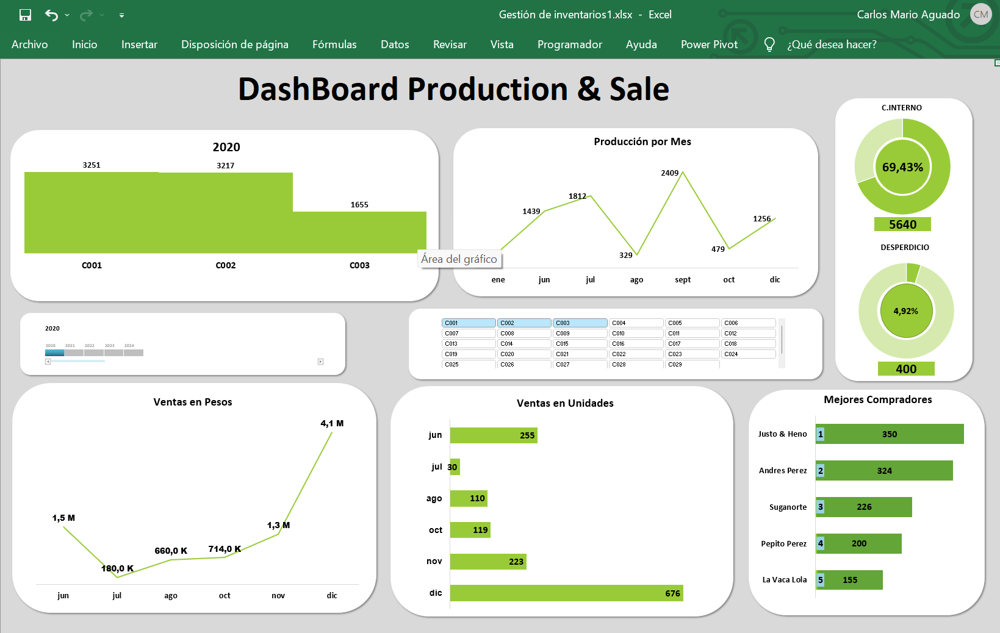

# LiveStock Feed Dashboard Small Business case (Colombia)

This project is based on a real operational case from a small agricultural company **(PYME)** in Colombia. The business expanded into the **livestock feed** market, starting with the local production and sale of **hay**. With no formal tracking system in place, key decisions were being made without reliable data.
This dashboard was built in Microsoft Excel to give decision-makers immediate visibility into production, sales, waste, and client behavior — replacing a fully manual process with a structured, visual reporting tool.

# The Business Problem

The company managed inventory and sales tracking manually, which created three core issues:

- No visibility into how much product was lost to waste or internal consumption versus actual sales.
- No way to identify which clients were most valuable or most consistent.
- No performance indicators to evaluate whether the expansion was profitable.

## Objective

Design a dashboard that answers the questions a business owner actually asks:

- How much was produced, sold, and lost in a given period?
- Who are the most loyal and highest-value clients?
- What is the real margin between production cost and sales revenue?
- Where is waste occurring and at what volume?

## Tools Used

- Microsoft Excel — PivotTables, dynamic charts, and dashboard design
- Manual data cleaning and transformation
- Data storytelling applied to a real business context

## Preview

## File structure

| File | Description | 
| :----------- | :---------- |
| `Dashboard_EN.xlsx` | Fully functional dashboard in English|
| `Readme_EN.md`       | This documentation |

| File | Description |
| `Dashboard_EN.xlsx` | Fully functional dashboard in English |
| `Readme_EN.md`| This documentation |

**NOTE:** This is a simplified version of a real business case. All sensitive data has been anonymized. 

## Key Takeaways

Building this dashboard reduced the time the owner spent compiling weekly reports from several hours to minutes, and provided the first clear picture of client concentration risk — two clients represented over 60% of total sales volume.

