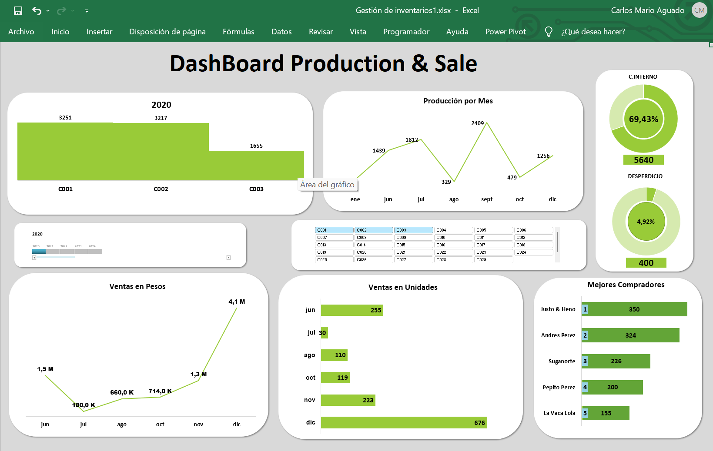

# 📊 Dashboard de Concentrados para Ganado (Caso de PYME – Colombia)

Este proyecto está basado en un caso real de una pequeña empresa agrícola en Colombia (*PYME*) que decidió diversificar su portafolio ingresando al mercado de **alimentación para ganado**, comenzando con la producción y venta de **heno**.

## 🧩 El Desafío

Debido al control manual del inventario y la falta de datos en tiempo real, la empresa enfrentaba:
- Altos niveles de desperdicio y consumo interno
- Escasa visibilidad del comportamiento de los clientes
- Baja conversión de la producción en ventas efectivas
- Ausencia de indicadores de desempeño

## 💡 Objetivo

Este dashboard fue diseñado para dar claridad y visibilidad a quienes toman decisiones.  
Responde preguntas clave como:
- ¿Cuánto se produce, se vende o se pierde?
- ¿Quiénes son los clientes más fieles?
- ¿Cuál es el valor real de lo vendido frente a lo producido?
- ¿Qué tanto se pierde por consumo interno o desperdicio?

## 🛠️ Herramientas utilizadas

- Microsoft Excel (Dashboards + Tablas dinámicas)
- Limpieza manual de datos
- Técnicas de storytelling con datos

## 📷 Vista previa

## 🗂️ Estructura del repositorio

- `Dashboard_ES.xlsx`: Dashboard completo en español
- `Readme_ES.md`: Esta documentación

📎 **Nota**: Este es un caso simplificado basado en una situación real. Toda la información sensible ha sido anonimizada.
